name: inverse
layout: true
class: center, middle, inverse
---
template: inverse
class: center, middle
# Django et l'async: je t'aime moi non plus
[dans le contexte d'un jeu web]

## Par Stéphane "Twidi" Angel

.footnote[Django meetup Paris, 2023-04-25]

---
layout: false
.left-column[
  ## Présentation
  ### Votre serviteur
]
.right-column.center[
### Stéphane "Twidi" Angel

### Développeur backend

### France - Proche Paris
]

--
.right-column.center[
### 1997 - 2007: Perl

### 2007+ : Python & Django
]
---
.left-column[
## Présentation
### Votre serviteur
### Disclaimer
]

.right-column.center[
## “Je ne suis pas un expert en async”
]
---
.left-column[
## Présentation
### Votre serviteur
### Disclaimer
### Hexpo.io
]

.right-column.center[
### Jeu web

### Conquête de territoires

### Tour par tour

### Multiplayer

### Mode solo contre bots
]

--

.right-column.center[
# HEXAGOOONES
.footnote[Hexagons are the bestagons]

]

---
class: two-columns-img-only
.left-column[
## Présentation
### Votre serviteur
### Disclaimer
### Hexpo.io
]

.right-column[
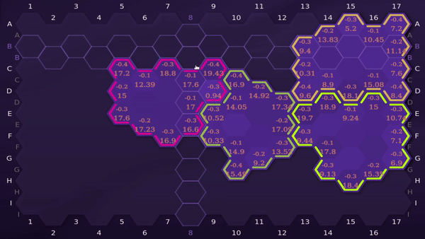

]

---

.left-column[
## Présentation
### Votre serviteur
### Disclaimer
### Hexpo.io
### La stack
]

.right-column.center[
### python 3.10

### django 4.1

### postgresql

### aiohttp

### websockets

### htmx (front)
]
---
template: inverse

## Async, kesako ?

---
template: inverse
## Les différents paradigmes
---
.left-column[
## Async, kesako ?
### Les différents paradigmes
]

.right-column[
### Modèle classique
Mono thread synchrone (tout est bloquant)

### MultiThreading
Mono processus, multi threads (tout est bloquant)

Warning: GIL => threads pour tâches I/O

(vivement python 3.12: 1 GIL par interpréteur)

### MultiProcessing
Multi processus, mono/multi threads (tout est bloquant)
Pas de GIL partagé => utilisable pour tâches CPU

### Async
Mono processus, mono thread (asynchrone: l'I/O n'est pas bloquante)
]

---
template: inverse
## Et donc, en quelques mots, c'est quoi ?
---
.left-column[
## Async, kesako ?
### Les différents paradigmes
### Async en quelques mots
]
.right-column[
### Non bloquant

Exécution simultanée de tâches sans bloquer le programme principal.

### Non séquentiel / Concurrence

Gestion efficace de plusieurs tâches en même temps.

### Event loop

Gestion des tâches en attente.

### Coroutines

Fonctions qui peuvent être suspendues puis reprises.
]
---
template: inverse
## Quels sont les inconvénients ?
---
.left-column[
## Async, kesako ?
### Les différents paradigmes
### Async en quelques mots
### Inconvénients?
]
.right-column[
### Complexité

- code plus difficile à comprendre et à maintenir
- difficulté à déboguer
- difficulté à gérer les erreurs

### Compatibilité

- nombreux frameworks et librairies ne sont pas compatibles avec l'async

### Performance

- en cas de tâches coûteuses en CPU/temps, les autres tâches attendent
- gestion de l'ordonnancement des tâches

### Apprentissage

- courbe d'apprentissage des concepts et techniques potentiellement assez abrupte
]
---
template: inverse
## Son histoire dans python et django 
---
.left-column[
## Async, kesako ?
### Les différents paradigmes
### Async en quelques mots
### Inconvénients?
### Historique
]
.right-column[
- Avant Python 3.4: Twisted, Tornado, gevent...

- Python 3.4 (2014): asyncio

- Python 3.5 (2015): async/await

- Django 3.0 (2020): ASGI

- Django 3.1 (2021): async views & middlewares

- Django 4.1 (2022): (pseudo, partial) async ORM & async class-based views

- Django 4.2 (2023): (pseudo, partial) async ORM, la suite
]
---
template: inverse
## Apparté
[Votre serviteur et l'async/la concurrence]
---
.left-column[
## Apparté
### Votre serviteur et l'async/la concurrence
]

.right-column[
### Multi-processing

Différents types de communication inter processus:
  - avec `Redis` (queues (listes bloquantes), pub-sub...)
  - avec les primitives de base: queues, locks, events, conditions, shared memories
  - reste pratique car beaucoup de mes projets sont CPU bound

### Async

Mes expériences:

1. En pro: mur de webcams (multiprocess mais aussi async pour `aiohttp` + `airtc`)
]
---
class: two-columns-img-only
.left-column[
## Apparté
### Votre serviteur et l'async/la concurrence
]

.right-column[

]
---
.left-column[
## Apparté
### Votre serviteur et l'async/la concurrence
]

.right-column[
### Multi-processing

Différents types de communication inter processus:
  - avec `Redis` (queues (listes bloquantes), pub-sub...)
  - avec les primitives de base: queues, locks, events, conditions, shared memories
  - reste pratique car beaucoup de mes projets sont CPU bound

### Async

Mes expériences:

1. En pro: mur de webcams (multiprocess mais aussi async pour `aiohttp` + `airtc`)

2. En perso: utilisation de la lib `websockets` (standalone) à différentes petites occasions

3. En perso: `hexpo.io`, première utilisation "intensive" (à mon niveau)

4. C'est tout
]

---
template: inverse
## Architecture du jeu
---
class: two-columns-img-only
.left-column[
## Architecture
### De l'utilisateur...
]

.right-column[
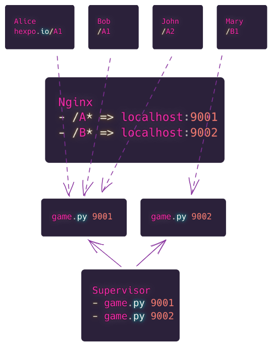
]
---
class: two-columns-img-only
.left-column[
## Architecture
### De l'utilisateur...
### ... au process
]

.right-column[
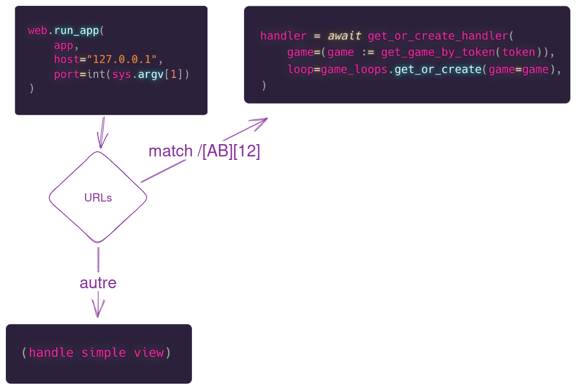
]
---
class: two-columns-img-only
.left-column[
## Architecture
### De l'utilisateur...
### ... au process
### La game loop
]

.right-column[
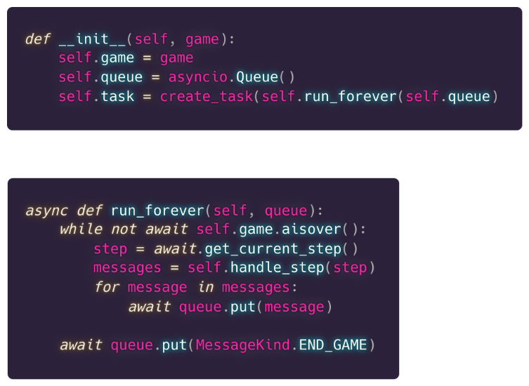
]
---
class: two-columns-img-only
.left-column[
## Architecture
### De l'utilisateur...
### ... au process
### La game loop
### Process principal (suite)
]

.right-column[
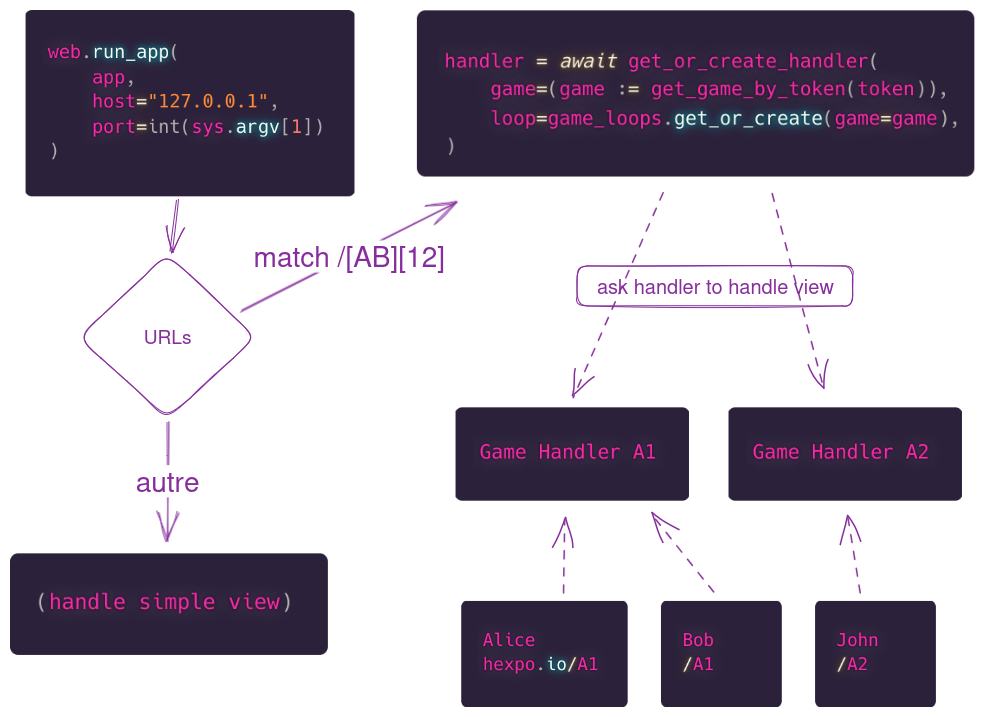
]
---
class: two-columns-img-only

.left-column[
## Architecture
### De l'utilisateur...
### ... au process
### La game loop
### Process principal (suite)
### Le game handler
]

.right-column[
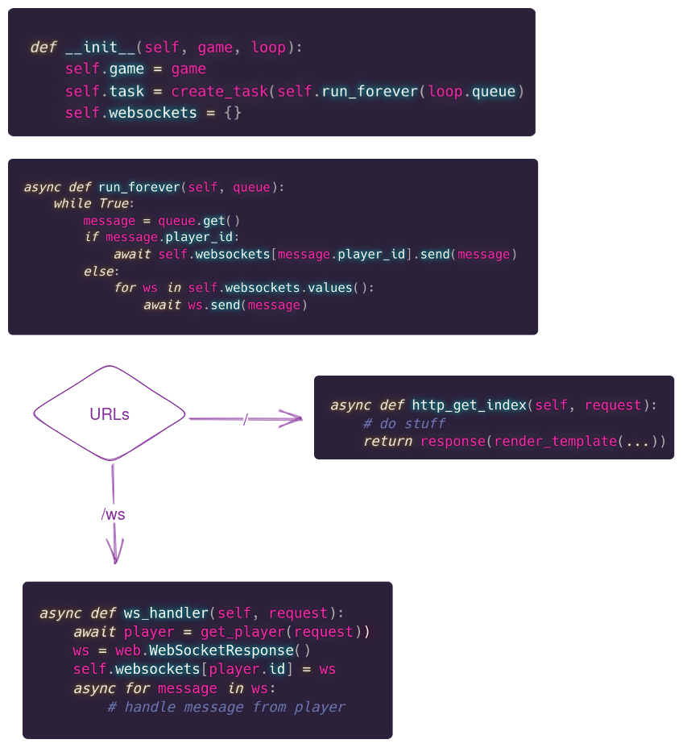
]
---
template: inverse
## Les besoins
---
.left-column[
## Les besoins
### Web classique
]

.right-column.center[
### authentification

### vues

### templates _(y compris la map, en svg)_

### modèles
## ➡ DJANGO
]
---
.left-column[
## Les besoins
### Web classique
### Jeu "temps réel"
]

.right-column.center[
### websockets
## ➡ ASYNC
]
---
template: inverse
## Et concrètement ?
---
.left-column[
## Le concret
### ORM
]

.right-column.center[
##L'ORM de Django supporte l'async
]
--
.right-column.center[
###Enfin...
]
--
.right-column.center[
##Idée générale: `sync_to_async`
]

--
.right-column.center[
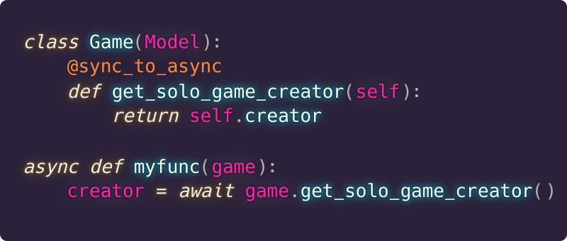
]
---
.left-column[
## Le concret
### ORM
]

.right-column.center[
## Fonctionnement
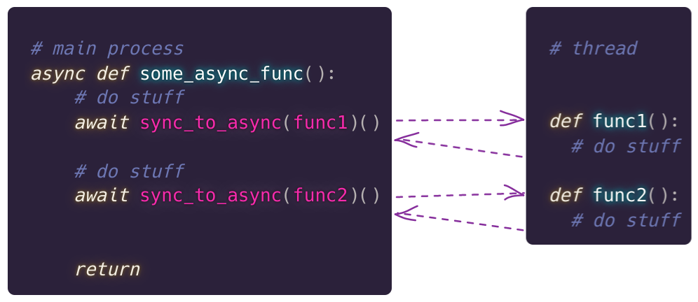

]
---
.left-column[
## Le concret
### ORM
]

.right-column.center[

##Problème
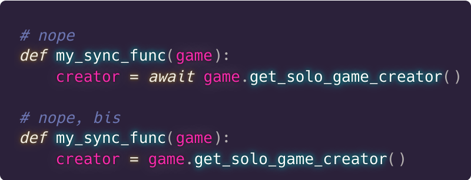
]
---
.left-column[
## Le concret
### ORM
]

.right-column.center[
##Solutions

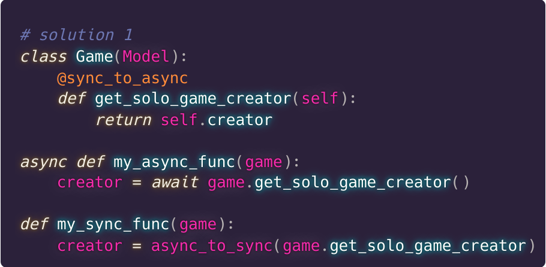
]
---
.left-column[
## Le concret
### ORM
]

.right-column.center[
##Solutions

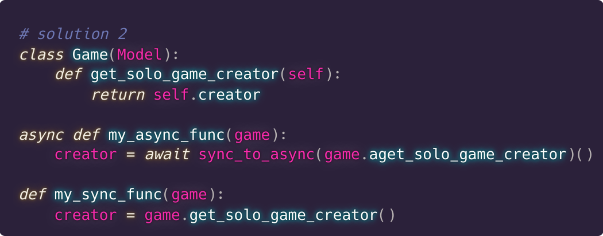
]
---
.left-column[
## Le concret
### ORM
]

.right-column.center[
##Solutions

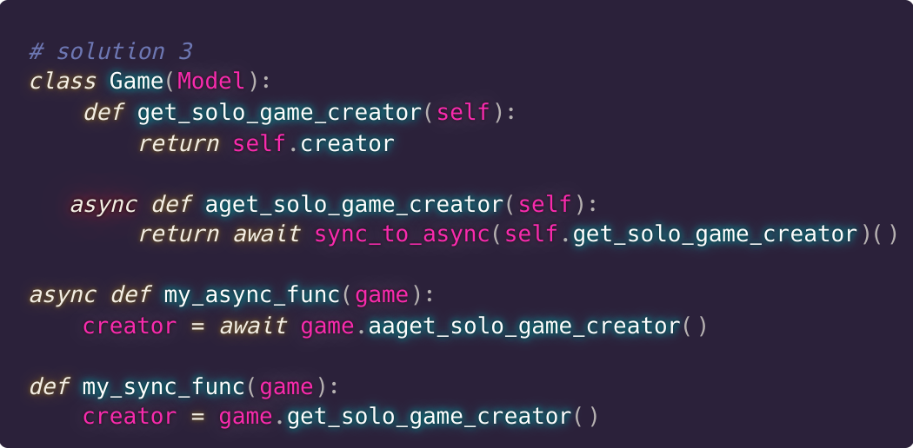
]

---
.left-column[
## Le concret
### ORM
### Disclaimer
]

.right-column.center[
### Ce talk parle de Django 4.1

Développement du jeu commencé fin 2022.

Django 4.2 est sorti récemment.

Donc plus besoin de ça:

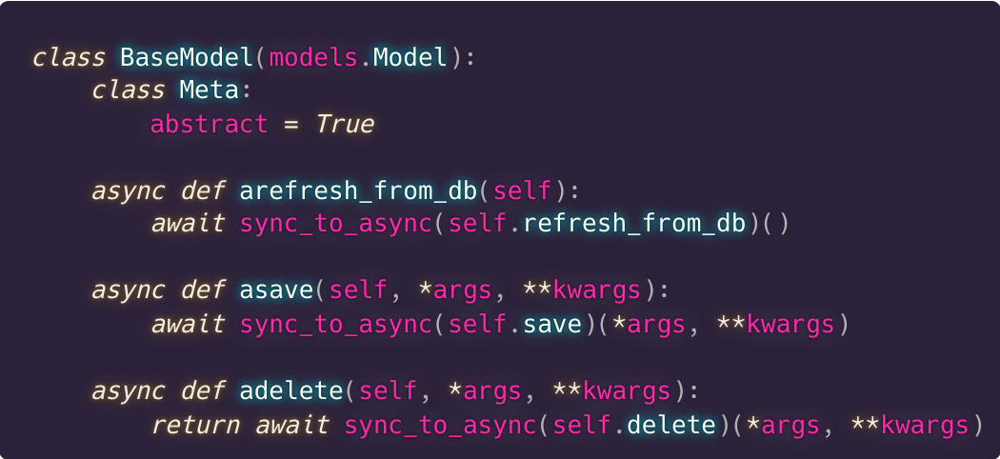

]
---
.left-column[
## Le concret
### ORM
]

.right-column.center[
## Piège

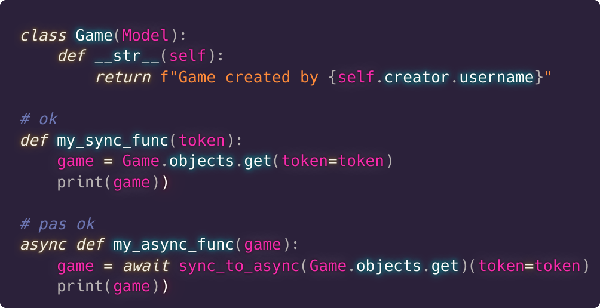

]
--
.right-column.center[
## ➡ TANT MIEUX
]
---
.left-column[
## Le concret
### ORM
]

.right-column.center[
## Solution

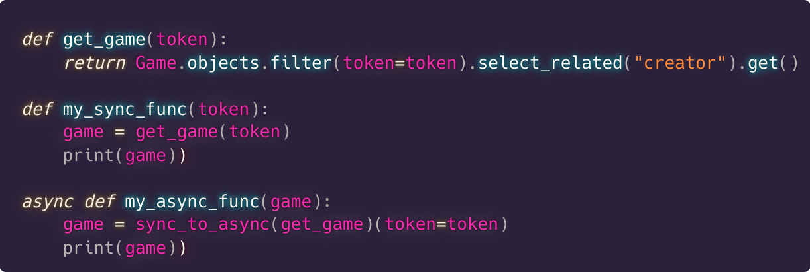

]

---
.left-column[
## Le concret
### ORM
### Templates
]

.right-column.center[
## Templates OK
]
--
.right-column.center[
### Sauf si requêtes ORM
]
---
.left-column[
## Le concret
### ORM
### Templates
### Vues Django
]

.right-column.center[
## Support vues OK (avec middlewares)
### ~~WSGI~~

~~Gunicorn~~

### ASGI

Daphne

Hypercorn

Uvicorn
]
---
.left-column[
## Le concret
### ORM
### Templates
### Vues Django
]

.right-column.center[
## Exemple
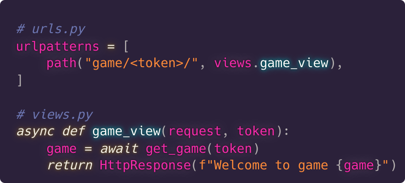
]

---
.left-column[
## Le concret
### ORM
### Templates
### Vues Django
### Websockets
]

.right-column.center[
## Websockets et Django
]

--
.right-column.center[
## AHEM

###Google "django websockets"
]

---
.left-column[
## Le concret
### ORM
### Templates
### Vues Django
### Websockets
### django-channels
]

.right-column[
## “A Beginners Guide to WebSockets in Django”

(part 1)

- install Django Channels (`pip install channels`)

- add `channels` to `INSTALLED_APPS`

- create `routing.py`

]
---
.left-column[
## Le concret
### ORM
### Templates
### Vues Django
### Websockets
### django-channels
]

.right-column[
## “A Beginners Guide to WebSockets in Django”

(part 2)

- create `consumers.py`

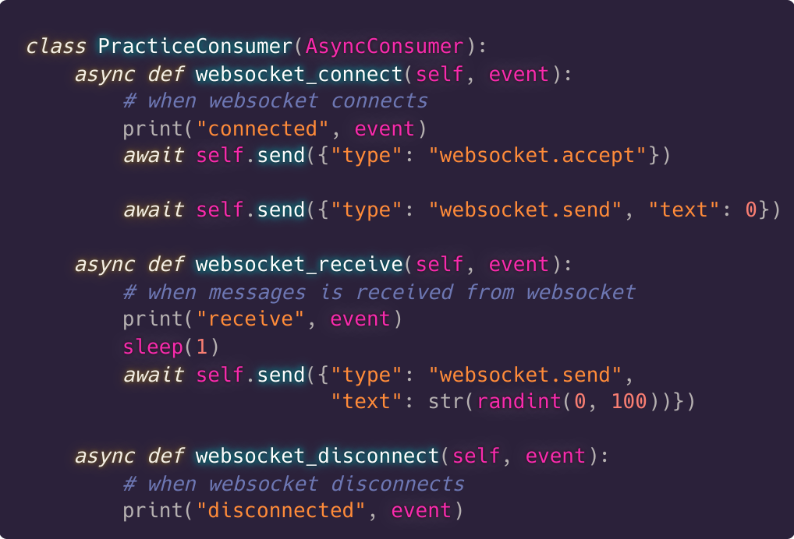

“Don’t get overwhelmed”
]
---
.left-column[
## Le concret
### ORM
### Templates
### Vues Django
### Websockets
### django-channels
]

.right-column[
## Switch to official Channels documentation tutorial

(part 1)

À peu près pareil, puis...

### “Enable a channel layer”

> A channel layer is a kind of communication system
]

--
.right-column[

]

--
.right-column[
#WOW
]
---
.left-column[
## Le concret
### ORM
### Templates
### Vues Django
### Websockets
### django-channels
]

.right-column[
## Switch to official Channels documentation tutorial

(part 2)

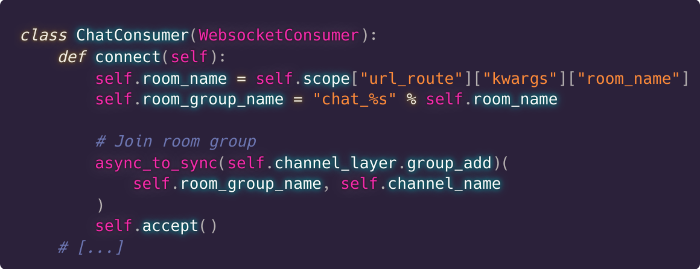

]

--
.right-column[
#STOOOOOOP
]

---
template: inverse
# L'abandon de django pour les vues
---
.left-column[
## Le concret
### ORM
### Templates
### Vues Django
### Websockets
### django-channels
### aiohttp
]
.right-column.center[
## aiohttp

async de base

requête -> réponse

routing

middlewares

templates django pour le html

### et WEBSOCKETS
]

---
.left-column[
## Le concret
### ORM
### Templates
### Vues Django
### Websockets
### django-channels
### aiohttp
]
.right-column.center[
## GameHandler: gère les vues d'une partie
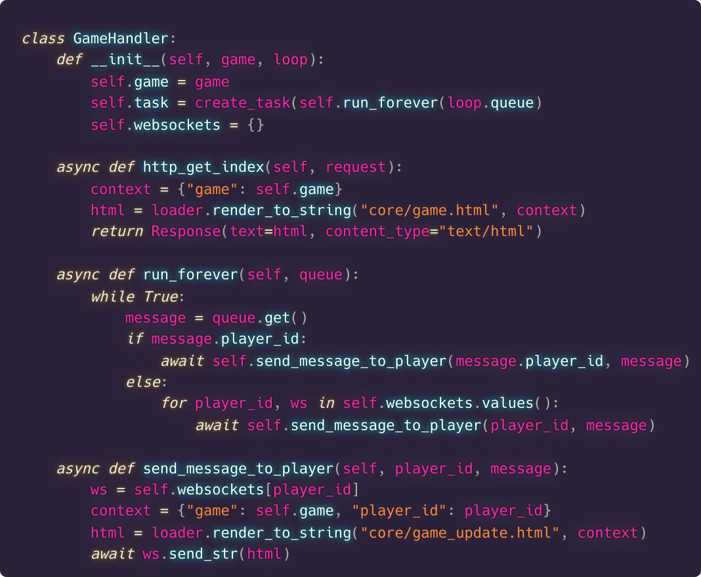
]

---
.left-column[
## Le concret
### ORM
### Templates
### Vues Django
### Websockets
### django-channels
### aiohttp
]
.right-column.center[
## GameHandler: gère les websockets
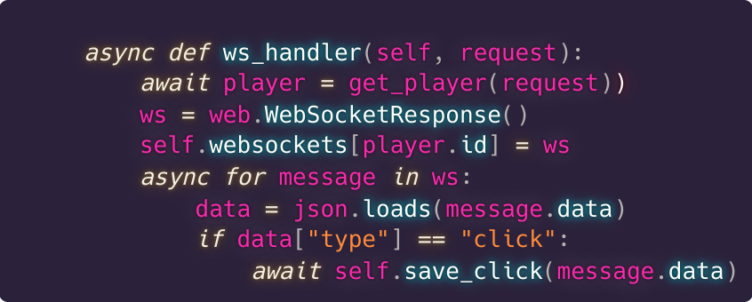
]
---
.left-column[
## Le concret
### ORM
### Templates
### Vues Django
### Websockets
### django-channels
### aiohttp
]
.right-column.center[
## Pourquoi aiohttp au lieu de Django

### Moins de dépendances
### Moins de complexité
### Plus proche de mes besoins

## ➡ Ça ne veut pas dire que django-channels n'a pas d'utilité
]

---
.left-column[
## Le concret
### ORM
### Templates
### Vues Django
### Websockets
### django-channels
### aiohttp
### autre
]

.right-column[
## Autres points

### Authentification
- formulaire django, rendu via template par une vue aiohttp
- lecture cookie dans vue/middleware
- `login` et `authenticate` de django
- cookies via requêtes/réponses `aiohttp` 
- `aiohttp-session`

### CSRF
- aiohttp-csrf

]
---
template: inverse
# Conclusion
---
template: inverse
# Conclusion
### ➡ Django et async: je t'aime, moi non plus

--
## I ❤️ Django
## I ❤️ Async
## I 💙 Django+async

### ➡ Pressé de voir l'évolution

---
template: inverse
# Merci

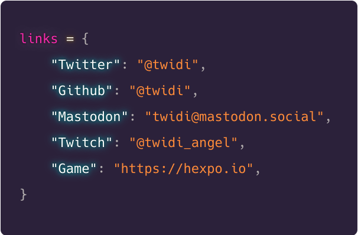
